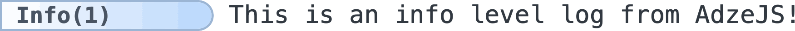

::: slot getting-started-is-easy

## Getting Started is Easy

First install Adze from [npm](https://www.npmjs.com/package/adze).

```bash
npm install -S adze
```

Then import it and start writing logs! No other configuration is required.

```typescript
import adze from 'adze';

adze().info("This is an info level log from AdzeJS!");
```
<span style="display: inline-block; max-width: 600px">



</span>
:::

::: slot browser-and-node

## Isomorphic By Nature

Modern JavaScript frameworks like [NextJS](https://nextjs.org/), [NuxtJS](https://nuxt.com/), and [SvelteKit](https://kit.svelte.dev/) combine your "back-end" and "front-end" code in the same location. **Adze is isomorphic** which means it can be executed in [node or the browser](/guide/installation.md) without any extra considerations.
:::

::: slot human-machine-readable

## Human &amp; Machine Readable

Adze supports outputting beautiful, human-readable logs as well as structured, machine-readable logs to meet the demands of any software environment. Take advantage of the beautiful default human-readable logs during development and output structure JSON logs in production. 

:::

::: slot typescript-support

## First Class Developer Experience

Adze is built with TypeScript from the ground up. Take advantage of all of the benefits of
using TypeScript with your app's logs.
:::

::: slot everything-configurable

## Everything is Configurable

Setup your logging exactly how you need it. [Everything with Adze is configurable](/config), from
the default log levels down to the emoji's your logs use. You can even create completely
custom log levels. How you use Adze is up to you.

```typescript
adze({ useEmoji: true }).success("I'm configured to use emoji's!");
```

:::


::: slot shed

## Adapts to Your Architecture

<!-- Whether you're building an API, micro-service, monolith, or micro-frontend Adze comes with the tools you need to effectively monitor your application. Take advantage of the Adze global store to track values across your application using Mapped Diagnostic Context or apply controls to multiple front-end applications simultaneously in the browser.

Unlock the potential of monitoring micro-frontend architectures with Adze. With Adze' global context you can effectively control your shell application's logs as well as all of the micro-applications that operate within it. Simply specify a global configuration, and voila! Your global configuration now takes precedence over the logging configuration of all of your micro-applications. -->

Unlock the potential of monitoring **micro-frontend architectures** through Adze. With Adze's global context, you gain precise control over both your shell application's logs and the micro-applications it includes. By defining a single global configuration, you can seamlessly override the logging settings of all your micro-applications, such as limiting their log levels, changing their output nature (human-readable to machine-readable), or hide logs from specific modules altogether.

<!-- Adze comes with all of the tools you need to support your application's architecture. With Adze' global context you can monitor many different  -->
:::

::: slot footer
Made by [Andrew Stacy](https://github.com/AJStacy) with ❤️

Find Adze on [GitHub](https://github.com/AJStacy/adze)
:::

::: slot learn-more

## And much more...

To learn more about Adze and how to use it in your project, take a look at the [Guide](/guide) and
watch the introduction video.
:::
